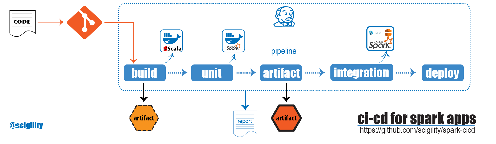

# CI for Spark Applications

This repository intends to demonstrate the usage of a
Continuous Integration Pipeline for Scala Apps to run on Apache spark



## Installing Continuous Integration Software

Jenkins was the CI tool choose to run these exercise.


## Adding Jenkins Pipeline

```
pipeline {
  agent any
  stages{
    stage('build') {
      steps {
        sh 'sbt clean compile'
      }
      stage('unit') {
        steps {
          sh 'sbt test'
        }
      }
      stage('artifact') {
        steps {
          sh 'sbt package'
          archiveArtifacts artifacts: 'target/scala-2.11/*.jar', fingerprint: true
        }
      }
      stage('integration') {
        steps {
        sh 'aws emr create-cluster --name "Add Spark Step Cluster" --release-label emr-5.6.0 --applications Name=Spark --ec2-attributes KeyName=myKey --instance-type m3.xlarge --instance-count 3 --steps Type=CUSTOM_JAR,Name="${env.BUILD_NUMBER}",Jar="target/scala-2.11/basicspark_2.11-1.0.jar",ActionOnFailure=CONTINUE,Args=[spark-example,SparkPi,10] --use-default-roles '
  }
}
    }
  }
}
```


## Installing Docker on Jenkins

Add Jenkis to the Docker Group
```
sudo usermod -aG docker jenkins
docker ps # check if it works
```

Configure Docker Service
```
vi (/usr/lib | /etc) /systemd/system/docker.service
ExecStart=/usr/bin/docker daemon -H unix:// -H tcp://localhost:2375
systemctl daemon-reload
systemctl restart docker
sudo service jenkins restart
```

## Configure AWS cli

Jenkins must be able to execute aws cicd-pipeline

```
sudo pip install awscli
aws Configure
```

## AWS EMR Spark

For running Spark as a service on AWS, make sure that you run:

```
aws emr create-default-roles
```

## Jenkins Jobs

### Backup Jobs
How to backup a Job configuration to an xml file
```
curl -s http://<user>:<password>@<jenkins_address>:<port>/job/<JOBNAME>/jenkins-job.xml
```

### Import Job

How to create a Job from from a Backup
```
CRUMB=$(curl -s 'http://<user>:<password>@<jenkins_address>:<port>/crumbIssuer/api/xml?xpath=concat(//crumbRequestField,":",//crumb)')
curl -H "$CRUMB" -X POST 'http://<user>:<password>@<jenkins_address>:<port>/createItem?name=CICDSPARK' --header "Content-Type: application/xml" -d @jenkins-job.xml
